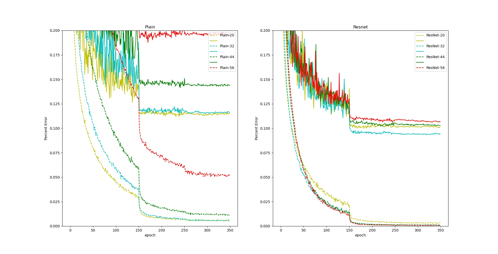

# ResNet Implementation for Cifar-10

The goal for this project was to create an implementation of ResNet as outlined in [Deep Residual Learning for Image Recognition](https://arxiv.org/abs/1512.03385)

